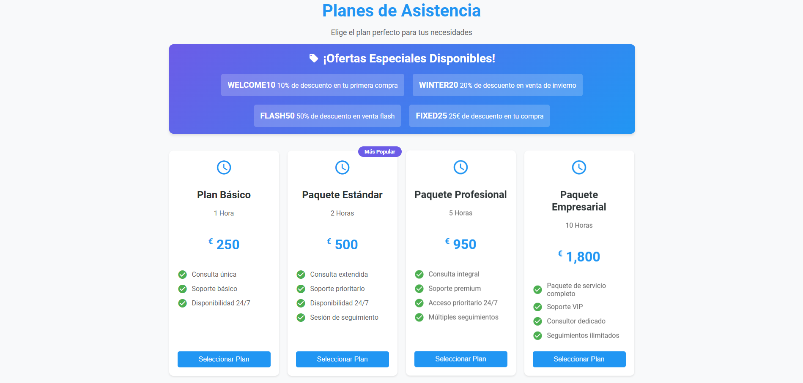

# 💳 Aplicación de Pagos con Stripe

<p align="center">
  
</p>

<div align="center">

[](https://nodejs.org/)
[](https://stripe.com/)
[](LICENSE)

</div>

## 🌟 Características Principales

- ✨ Procesamiento de pagos con tarjetas de crédito
- 🏷️ Sistema de códigos promocionales
- 🌍 Soporte multi-moneda
- 🔒 Integración segura con Stripe

## ⚡ Inicio Rápido

1️⃣ **Clona el repositorio e instala dependencias**
```bash
git clone [url-del-repositorio]
npm install
```

2️⃣ **Configura las variables de entorno**
```bash
# Archivo .env
SERVER_PORT=3000
APIKEY_STRIPE=tu_clave_secreta_de_stripe
```

## 📁 Estructura del Proyecto

```
└── 📂 root
  ├── 📄 main.js              # Servidor Express principal
  ├── 📄 config.js            # Configuración de variables
  ├── 📄 setupStripe.js       # Setup códigos promocionales
  ├── 📂 routes
  │   └── 📄 payment.routes.js
  └── 📂 controllers
    └── 📄 payment.controllers.js
```

## 💰 Planes Disponibles

| ID | Plan | Precio (EUR) |
|----|------|--------------|
| 1 | 🕐 Asistencia 1 hora | 250.00€ |
| 2 | 🕑 Pack 2 horas | 500.00€ |
| 3 | 🕔 Pack 5 horas | 950.00€ |
| 4 | 🕙 Pack 10 horas | 1,800.00€ |

## 🎟️ Códigos Promocionales

| Código | Descuento | Descripción |
|--------|-----------|-------------|
| `WELCOME10` | 10% | Primera compra |
| `WINTER20` | 20% | Venta de invierno |
| `FLASH50` | 50% | Venta flash |
| `FIXED25` | 25€ | Descuento fijo |

## 🧪 Tarjetas de Prueba

### 🟢 Tarjetas Básicas
```
✅ Éxito:         4242 4242 4242 4242
❌ Fallo:         4000 0000 0000 0002
🔐 Autenticación: 4000 0025 0000 3155
```

### 🌍 Tarjetas por Región
```
🇪🇸 España:    4000 0087 0000 0000
🇫🇷 Francia:   4000 0082 0000 0000
🇩🇪 Alemania:  4000 0084 0000 0000
```

### ⚠️ Casos Especiales
```
💰 Sin fondos:  4000 0000 0000 9995
❌ Perdida:     4000 0000 0000 9987
⌛ Expirada:    4000 0000 0000 0069
```

## 🔌 API Endpoints

```javascript
POST /api/v1/payment/create-checkout-session/:planId  // Crear sesión
GET  /api/v1/payment/success                         // Pago exitoso
GET  /api/v1/payment/cancel                          // Pago cancelado
```

## 🚀 Ejecutar el Proyecto

```bash
# Iniciar servidor
node main.js

# Configurar promociones
node setupStripe.js
```

## 🌐 URLs

```
📱 Frontend: http://localhost:3000
🔌 API:      http://localhost:3000/api/v1/payment
```

## ⚙️ Configuración

- 💶 Moneda predeterminada: EUR
- 🎫 Límite de códigos promo: 100 usos
- 🔓 CORS: Habilitado para todos los orígenes